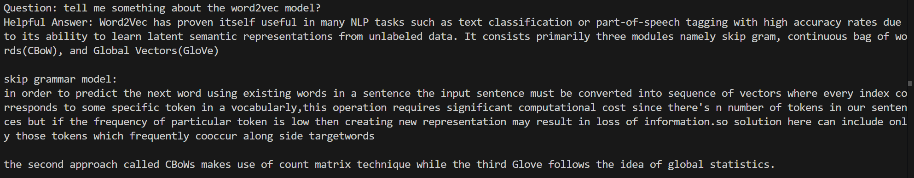

# Retrieval-Augmented Generation (RAG) QA System

This project implements a Retrieval-Augmented Generation (RAG) system for question answering (QA). It combines vector-based retrieval and advanced language model generation to provide accurate and contextually relevant answers.

## Features
- **Semantic Search**: Use FAISS for efficient vector-based retrieval.
- **Text Encoding**: Leverages MPNet embeddings for semantic representation.
- **Language Model**: Uses Meta LLaMA 3.2-3B for generating responses.
- **Customizable Workflow**: Modular pipeline for document loading, vector generation, and QA.

---

## Installation

1. Clone this repository:
   ```bash
   git clone https://github.com/Zhdddd7/ragQAbot
   cd ragqabot
   ```
2. pip install -r requirements.txt
```
pip install -r requirements.txt
```
3. login to Huggingface for models and pipelines
```
huggingface-cli login
```
## Usage
1. Run indexer.py to load documents, split text into chunks, and generate the FAISS vector index:
```
python indexer.py
```
2. Run rag.py to start the question-answering system and interact with it:
```
python rag.py
```
## Demo
Here is a demo to show the QA system


## Update
More techs may be updated to enhance the performance...


